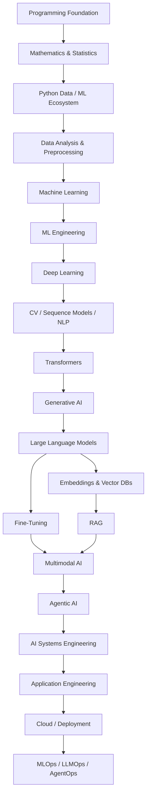
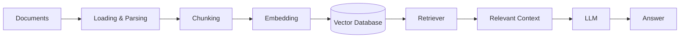
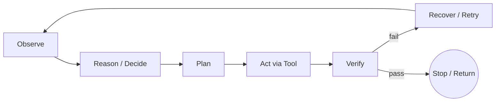

<div align="center">

# 🧠 AI / ML ROADMAP

### A Complete, Deep Guide — From Python to Production AI Systems, and Into a Career

</div>

---

## 📌 What This Is

If you're new here: this repository is a **full map of the AI/ML field** — not just a list of buzzwords, but an explanation of *what each concept actually is, why it exists, how it connects to the next one, and which jobs use it*.

By the end of this README you should be able to answer, in your own words:

- What is AI, ML, Deep Learning, and Generative AI, and how do they relate to each other?
- What do LLMs, RAG, and AI Agents actually do — mechanically, not just as marketing terms?
- What do you need to *learn and build* to be job-ready, at each stage?
- What actual jobs exist in this field, what do people in those jobs do all day, and what skills do those jobs require?

The roadmap is organized by **conceptual dependency** — each layer needs the one before it — not by which tool is currently trending.



> **Legend:** 🟢 Foundation · 🔵 Core · 🟣 Advanced · 🟠 Production

---

## 🧭 The Big Picture First: What *Is* AI/ML, Really?

Before the roadmap, here's the one-paragraph version of the entire field, so every section below has a place to attach to.

**Artificial Intelligence (AI)** is the broad goal: making machines do things that normally require human intelligence. **Machine Learning (ML)** is the dominant *method* we use to get there today: instead of hand-coding rules, you show a system lots of examples and it learns the pattern itself. **Deep Learning** is a specific ML technique that uses layered neural networks to learn very complex patterns directly from raw data (pixels, audio, text) instead of hand-engineered features. **Generative AI** is deep learning turned toward *creating* new content (text, images, audio, video) rather than just classifying or predicting. A **Large Language Model (LLM)** is a generative model specialized in text — trained to predict the next word so well that it can converse, reason, and follow instructions. **RAG (Retrieval-Augmented Generation)** is a technique for giving an LLM access to specific, current, or private knowledge it wasn't trained on, by fetching relevant documents and handing them to the model at answer-time. An **AI Agent** takes this further: instead of just answering, it can take actions — call tools, run code, query databases, and loop until a goal is done. Everything from "MLOps" to "AgentOps" is the engineering discipline of running these systems reliably once they leave a notebook and go into production.

That's the whole shape of the field. Everything below is the depth behind each piece.

---

## 🗺️ How To Use This Roadmap

1. Go top to bottom — each section assumes the previous ones.
2. Don't try to master every sub-bullet before moving on. Learn enough to build something, then come back.
3. Use the **Career Map** near the end *early* — pick a rough target role, then use the **Roadmap-Layer → Role Relevance** table to see which sections deserve deep focus vs. a working overview for your specific path.

---

<details open>
<summary><h2>🟢 01 — Programming Foundation</h2></summary>

Every other layer in this roadmap assumes you can write and reason about code. Python is the default language of AI/ML because its libraries (NumPy, PyTorch, Hugging Face, etc.) are the field's shared infrastructure.

**Python core:** Syntax, Variables & Data Types, Operators, Input/Output, Conditionals, Loops, Functions, Recursion, Lists, Tuples, Sets, Dictionaries, Strings, Comprehensions, Iterators, Generators, Lambda Functions, Decorators

**Object-Oriented Programming:** Classes, Objects, Inheritance, Polymorphism, Encapsulation, Abstraction — you'll use these constantly when reading library source code and structuring ML pipelines, even if you rarely design deep class hierarchies yourself.

**Practical Python:** Modules & Packages, Exception Handling, File Handling, Virtual Environments, `pip`, Type Hints, Testing, Debugging

**Development Tools:** Git, GitHub, Branching, Merging, Pull Requests, Version Control, Basic Linux/Terminal — you cannot collaborate on real ML projects (or read most tutorials) without these.

**Why it matters:** weak fundamentals here don't show up immediately — they show up later as "I understand the ML concept but can't implement it," which is the single most common place learners get stuck.

</details>

---

<details>
<summary><h2>🟢 02 — Mathematics & Statistics</h2></summary>

You don't need a math degree, but you need to understand *why* the algorithms work — otherwise ML becomes "copy code and hope," which breaks the moment something goes wrong in production.

**Linear Algebra** — the language ML is written in: Scalars, Vectors, Matrices, Matrix Operations, Dot Product, Norms, Linear Transformations, Eigenvalues/Eigenvectors, Singular Value Decomposition (SVD). Every neural network layer is fundamentally a matrix multiplication.

**Calculus** — how models learn: Functions, Limits, Derivatives, Partial Derivatives, Gradients, Chain Rule, Integrals, Optimization. Backpropagation (how neural networks update themselves) is literally the chain rule applied at scale.

**Probability** — how models reason under uncertainty: Random Variables, Conditional Probability, Bayes' Theorem, Expectation, Variance, Covariance, Probability Distributions.

**Statistics** — how you evaluate whether results are real: Mean/Median/Mode, Variance, Standard Deviation, Sampling, Confidence Intervals, Hypothesis Testing, Correlation.

**Optimization** — how models actually improve: Objective Functions, Loss Functions, Gradient Descent, Learning Rate, Convexity Basics.

**Information Theory** — the math behind how models measure "surprise" and "error": Entropy, Cross-Entropy, KL Divergence. Cross-entropy loss is the single most common training objective in both classification and language modeling.

</details>

---

<details>
<summary><h2>🔵 03 — Python Data & ML Ecosystem</h2></summary>

This is the toolbox you'll use in almost every project from here forward.

| Library | Purpose | What you'll actually do with it |
|---|---|---|
| NumPy | Numerical computing | Fast array math underneath almost everything else |
| Pandas | Data manipulation | Load, clean, filter, and reshape tabular data |
| Matplotlib / Seaborn | Visualization | Plot distributions, trends, and model results |
| SciPy | Scientific computing | Statistical tests, optimization, signal processing |
| Scikit-learn | Classical machine learning | Train/evaluate traditional ML models with a consistent API |
| Jupyter | Interactive experimentation | Iterate on data and models cell-by-cell |

**Skills to build:** loading and inspecting real datasets, building DataFrames, producing clear visualizations, running end-to-end ML pipelines with Scikit-learn before you ever touch deep learning.

</details>

---

<details>
<summary><h2>🔵 04 — Data Analysis & Preprocessing</h2></summary>

In real projects, **most of your time goes here, not on the model.** A great model trained on bad data produces bad results — this is the layer that prevents that.

**Data Preparation:** Data Collection, Data Cleaning, Exploratory Data Analysis (EDA — looking at your data before modeling it), Missing Values, Duplicate Data, Outlier Detection, Categorical Variable Encoding, Feature Scaling, Normalization, Standardization.

**Feature Engineering:** Feature Creation, Feature Transformation, Feature Selection, Dimensionality Reduction — turning raw data into signals a model can actually use.

**Dataset Management:** Training / Validation / Test Split, Cross-Validation, Data Leakage (accidentally letting information from the test set influence training — a subtle bug that inflates results and quietly ruins models), Class Imbalance, Data Augmentation, Reproducibility.

**Why it matters:** "garbage in, garbage out" isn't a cliché in this field — it's the most common reason real-world models underperform their benchmarks.

</details>

---

<details>
<summary><h2>🔵 05 — Machine Learning</h2></summary>

This is the classical core of the field — algorithms that find patterns in structured data.

### Supervised Learning
You give the model labeled examples (input → correct answer), and it learns the mapping.

- **Regression** (predicting a number): Linear Regression, Polynomial Regression, Regularization (Ridge/Lasso/ElasticNet — techniques that prevent the model from over-relying on any one feature)
- **Classification** (predicting a category): Logistic Regression (despite the name, this is a classifier, not a regression model — it predicts a probability of belonging to a class), K-Nearest Neighbors (KNN), Naive Bayes, Decision Trees, Random Forest, Support Vector Machines (SVM), Gradient Boosting, XGBoost, LightGBM, CatBoost

### Unsupervised Learning
You give the model unlabeled data and ask it to find structure on its own.

- **Clustering:** K-Means, Hierarchical Clustering, DBSCAN, Gaussian Mixture Models
- **Dimensionality Reduction:** PCA, t-SNE, UMAP — compressing many features into fewer while preserving structure, both for modeling and for visualization
- **Anomaly Detection:** finding the data points that don't fit the pattern (fraud, defects, intrusions)

### Reinforcement Learning (RL)
An agent learns by **interacting with an environment** and receiving rewards or penalties — it is *not* "learning without data"; the data is the experience it generates (sequences of state, action, reward) rather than a fixed labeled dataset handed to it upfront.

```text
Agent --Action--> Environment --State + Reward--> Agent --Repeat-->
```

**Concepts:** Agent, Environment, State, Action, Reward, Policy, Value Function, Q-Function, Markov Decision Process, Exploration vs. Exploitation
**Algorithms:** Q-Learning, SARSA, DQN, Policy Gradient, Actor-Critic, PPO — this last one, PPO, is also the algorithm behind RLHF, the technique used to align modern chatbots (see §15).

</details>

---

<details>
<summary><h2>🔵 06 — ML Engineering</h2></summary>

Building a model is easy; knowing whether it's actually good, and making that measurement repeatable, is the real skill.

**Evaluation — Classification:** Accuracy, Precision, Recall, F1 Score, ROC-AUC, PR-AUC, Confusion Matrix. Accuracy alone is misleading on imbalanced data (a model that always predicts "not fraud" can be 99% accurate and useless) — this is why Precision/Recall/F1 exist.

**Evaluation — Regression:** MAE, MSE, RMSE, R².

**Model Optimization:** Cross-Validation, Hyperparameter Tuning, Grid Search, Random Search, Bayesian Optimization.

**Engineering practice:** Scikit-learn Pipelines (chaining preprocessing + model into one reusable object), Model Serialization (saving a trained model to disk), Experiment Tracking (recording what you tried and what worked), Reproducibility, Model Comparison.

</details>

---

<details>
<summary><h2>🔵 07 — Deep Learning</h2></summary>

Deep Learning trades hand-engineered features for **layered neural networks that learn representations directly from raw data**. This is the technique behind everything from image recognition to modern LLMs.

**Neural Network basics:** Artificial Neurons, Perceptron, Multi-Layer Perceptron (MLP — a stack of fully connected layers with nonlinear activations in between; it has no built-in sense of space or sequence, which is precisely why CNNs exist for images and RNNs/Transformers exist for sequences), Layers, Weights, Bias, Parameters.

**How training works:** Forward Propagation (data flows through the network to produce a prediction), Backpropagation (the error flows backward to compute how each weight should change — this is calculus's chain rule in action), Computational Graphs, Loss Functions.

**Activation Functions** (what makes networks capable of learning nonlinear patterns): ReLU, Sigmoid, Tanh, Softmax.

**Optimizers** (the update rule for weights): SGD, Momentum, Adam, AdamW.

**Regularization** (preventing the network from memorizing instead of generalizing): Dropout, Batch Normalization, Layer Normalization, Weight Initialization, Learning Rate Scheduling.

**Common failure modes:** Overfitting (memorizing training data, failing on new data), Underfitting (too simple to capture the pattern), Vanishing/Exploding Gradients (training signal becomes too weak or too unstable in deep networks).

**Frameworks:** PyTorch (the current industry default for research and most production LLM work), TensorFlow, Keras.

</details>

---

<details>
<summary><h2>🔵 08 — Computer Vision</h2></summary>

Teaching machines to interpret images and video.

**Foundations:** Images as Tensors (a color image is just a 3D grid of numbers), Image Preprocessing, Image Augmentation, OpenCV.

**Convolutional Neural Networks (CNN):** Convolution, Kernels, Filters, Feature Maps, Pooling, Stride, Padding — CNNs exploit the fact that nearby pixels are related, which is why they outperform plain MLPs on images.

**Tasks:** Image Classification, Transfer Learning (reusing a model pretrained on huge datasets instead of training from scratch), Object Detection, Semantic Segmentation, Instance Segmentation, OCR.

**Modern Vision:** YOLO (real-time object detection), Vision Transformers, Image Embeddings, Vision-Language Models (models that connect images and text, like the ones powering "describe this photo").

</details>

---

<details>
<summary><h2>🔵 09 — Sequence Modeling</h2></summary>

Architectures built for data where **order matters** — text, audio, time series.

Sequential Data · RNN (Recurrent Neural Network — processes one element at a time, carrying a memory forward) · LSTM & GRU (RNN variants designed to remember longer-range information) · Bidirectional RNN · Seq2Seq · Encoder-Decoder · Attention · Teacher Forcing · Sequence Generation

> RNNs and LSTMs remain useful for streaming, low-latency, or resource-constrained settings, but Transformers (§11) have replaced them for most modern NLP and multimodal work, because attention can be computed in parallel across a whole sequence while recurrence must be computed one step at a time.

</details>

---

<details>
<summary><h2>🔵 10 — Natural Language Processing (NLP)</h2></summary>

Teaching machines to work with human language — the direct predecessor to modern LLMs.

**Text Processing:** Text Cleaning, Tokenization (splitting text into units a model can consume), Stop Words, Stemming, Lemmatization, N-Grams.

**Classical NLP:** Bag of Words, TF-IDF — counting-based ways of representing text before neural embeddings existed.

**Word Representations:** Word2Vec, GloVe, FastText, Word Embeddings — the first techniques to represent words as vectors capturing meaning (this idea is the direct ancestor of the embeddings used in RAG, §16).

**Classic tasks:** Text Classification, Sentiment Analysis, Named Entity Recognition (NER), Part-of-Speech (POS) Tagging, Language Modeling, Text Generation.

</details>

---

<details>
<summary><h2>🟣 11 — Transformers</h2></summary>

The architecture behind essentially every modern LLM, and one of the most important ideas in the last decade of AI.

**Attention — the core idea:** Query, Key, Value, Scaled Dot-Product Attention, Self-Attention, Multi-Head Attention. Attention lets a model weigh how relevant every other word in a sequence is to the word it's currently processing — all at once, in parallel, instead of one step at a time like an RNN.

**Full architecture:** Positional Encoding/Embeddings (since attention has no built-in sense of word order, this injects it back in), Feed-Forward Networks, Residual Connections, Layer Normalization, Encoder, Decoder, Encoder-Decoder Architecture, Masked Attention, Causal Attention (prevents a model from "seeing the future" tokens during generation).

**Landmark architectures:**
- **BERT** — encoder-only, built for *understanding* text (classification, search)
- **GPT** — decoder-only, built for *generating* text one token at a time (the family behind most modern chat LLMs)
- **T5** — encoder-decoder, built for text-to-text tasks like translation and summarization

</details>

---

<details>
<summary><h2>🟣 12 — Generative AI</h2></summary>

The umbrella term for AI systems that **create new content** rather than only classify or predict.

**Generative model families:** Autoencoders, Variational Autoencoders (VAE), GANs (two networks — a generator and a discriminator — competing until the generator produces convincing fakes), Diffusion Models (the current standard for image/video generation — they learn to reverse a noise-adding process), Foundation Models (very large models pretrained on broad data, then adapted to many downstream tasks — LLMs are one kind of foundation model).

**Modalities:** Text Generation, Image Generation, Audio Generation, Video Generation, Multimodal Generation.

</details>

---

<details>
<summary><h2>🟣 13 — Large Language Models (LLMs)</h2></summary>

An LLM is a Transformer-based model trained on enormous amounts of text to predict the next token — and that simple objective, at large enough scale, produces the ability to converse, summarize, reason, and follow instructions.

**Fundamentals:** LLM/Transformer Architecture, Foundation Models, Pretraining, Self-Supervised Learning (the model creates its own training signal from raw text — no human labeling needed), Next-Token Prediction.

**Data:** Dataset Preparation, Data Filtering, Data Quality, Tokenization, Vocabulary, Tokens.

**Model internals:** Embeddings (the vector representation of a token), Parameters, Weights, Logits (raw model scores before conversion to probabilities), Softmax, Attention, Context Window (the maximum amount of text the model can "see" at once).

**Scaling:** Model Size, Scaling Laws (the observed relationship between model size, data size, compute, and performance), Compute, Training Data.

**How inference actually works, step by step:**
```text
Your Prompt → Tokens → Model Forward Pass → Logits → Probabilities → Sample Next Token → Repeat
```
Every response you get from a chatbot is this loop running one token at a time.

</details>

---

<details>
<summary><h2>🟣 14 — LLM Inference & Decoding</h2></summary>

Once a model produces probabilities for the next token, something has to decide *which* token to actually pick — that's decoding.

**Decoding strategies:** Greedy Decoding (always pick the most likely token — deterministic but often dull/repetitive), Sampling, Temperature (controls randomness — low = focused, high = creative), Top-K, Top-P/Nucleus Sampling, Beam Search, Repetition Penalty, Stop Tokens.

**Making inference fast and cheap at scale:** Context Management, KV Cache (reusing previously computed attention values so generating token N+1 doesn't recompute everything from scratch), Batching, Streaming, Quantization (reducing numeric precision to cut memory/compute cost — see §21), Latency, Throughput.

</details>

---

<details>
<summary><h2>🟣 15 — LLM Adaptation & Fine-Tuning</h2></summary>

Once you have a base LLM, there are two very different ways to make it more useful for your specific need — and knowing which one to reach for is a core skill.

**Prompt Engineering** — changing *what you ask*, not the model itself: Zero-Shot Prompting, Few-Shot Prompting, System Prompts, Structured Outputs, Prompt Templates. This is always the cheapest thing to try first.

**Fine-Tuning** — changing the *model's weights*: Instruction Tuning (teaching a base model to follow instructions), Supervised Fine-Tuning (SFT), Preference Optimization, RLHF (Reinforcement Learning from Human Feedback — humans rank model outputs, and that preference signal trains the model via RL, typically PPO), DPO (Direct Preference Optimization — a newer, simpler alternative to RLHF that skips the separate reward model).

**Parameter-Efficient Fine-Tuning (PEFT)** — getting most of fine-tuning's benefit at a fraction of the cost: LoRA, QLoRA (these update a small number of extra parameters instead of the whole model, making fine-tuning possible on consumer hardware).

**Model Optimization for deployment:** Quantization, Distillation (training a smaller model to mimic a larger one).

### Deciding: RAG or Fine-Tuning?

| Your requirement | Better approach |
|---|---|
| Frequently changing knowledge (news, prices, docs that update) | RAG |
| Private or proprietary documents | RAG |
| External, queryable knowledge in general | RAG |
| Consistent output format or tone | Fine-Tuning |
| A specific behavior or task specialization | Fine-Tuning |
| You need both current knowledge *and* changed behavior | RAG + Fine-Tuning together |

</details>

---

<details>
<summary><h2>🟣 16 — Embeddings & Vector Databases</h2></summary>

This is the machinery that makes RAG possible.

**Embeddings:** a numeric vector representation of text (or images, or audio) such that *meaning* translates into *geometry* — texts with similar meaning end up as vectors that are close together. Text Embeddings, Image Embeddings, Multimodal Embeddings, Vector Representations, Semantic Similarity, Cosine Similarity (the standard way to measure "closeness" between two embedding vectors).

**Vector Search:** Vector Indexing, Similarity Search, Approximate Nearest Neighbor Search (finding "close enough" matches fast, since exact search over millions of vectors is too slow), Metadata Filtering.

**Vector Databases / Systems:** FAISS, Chroma, Pinecone, Weaviate, Milvus, pgvector — these store embeddings and let you search them efficiently at scale.

</details>

---

<details>
<summary><h2>🟣 17 — Retrieval-Augmented Generation (RAG)</h2></summary>

RAG solves a fundamental LLM limitation: the model only "knows" what was in its training data, and that data is frozen at training time. RAG fixes this by fetching relevant, current, or private information at answer-time and handing it to the model as context.



**Core components, explained in order:**
1. **Document Loading & Parsing** — get your source documents into text
2. **Chunking** — split documents into smaller pieces (chunk size and overlap both matter a lot for quality)
3. **Embedding** — convert each chunk into a vector
4. **Indexing** — store those vectors in a vector database
5. **Retrieval** — given a user's question, find the most relevant chunks
6. **Context Construction** — assemble the retrieved chunks into the prompt
7. **Generation** — the LLM answers using that context
8. **Reranking** — an optional extra step that re-scores retrieved results for relevance before they reach the LLM

**Advanced retrieval techniques:** Hybrid Search (combining keyword search and vector search — vectors alone miss exact terms like product codes or names), Metadata Filtering, Query Expansion / Query Rewriting, Multi-Query Retrieval, Parent-Child Retrieval, Corrective RAG (detects weak retrieval and tries again), Graph RAG (retrieval over a knowledge graph instead of, or in addition to, flat text chunks).

**Evaluation:** Retrieval Evaluation, Generation Evaluation, Context Relevance, Answer Relevance, Faithfulness (does the answer actually match the retrieved evidence?), Hallucination Analysis.

### Agentic RAG

Basic RAG is a fixed pipeline: retrieve once, generate once. **Agentic RAG** replaces that fixed pipeline with an agent that *decides* whether, what, and how many times to retrieve:

```text
Agentic RAG
├── Query Planning        — break a complex question into sub-questions before retrieving
├── Tool Selection         — choose vector search vs. SQL vs. web search vs. a specific API
├── Iterative Retrieval     — retrieve, read, and retrieve again if the first pass was insufficient
├── Corrective / Adaptive Retrieval — detect weak or contradictory context, reformulate, retry
└── Verification           — check that retrieved evidence actually supports the final answer
```

> **RAG vs. Agents, precisely:** RAG is a retrieval *architecture*. An Agent is a *control loop that chooses actions*. Agentic RAG is what happens when an agent treats retrieval as just one tool among several, instead of a fixed pipeline stage it always runs.

</details>

---

<details>
<summary><h2>🟣 18 — Multimodal AI</h2></summary>

Systems that work across more than one type of data at once.

**Modalities:** Text, Images, Audio, Video.

**Technologies:** Vision-Language Models (understand images and text together — e.g., answering questions about a photo), Image Understanding, Speech-to-Text, Text-to-Speech, Audio Understanding, Multimodal Embeddings (a shared vector space across modalities, so an image and its caption can be compared directly), Multimodal LLMs.

</details>

---

<details>
<summary><h2>🟣 19 — Agentic AI</h2></summary>

An **AI agent** combines a model with reasoning, tools, memory, and state so it can pursue a goal across multiple steps — not just answer one question, but *do* something, checking its own progress along the way.

### Five terms people constantly confuse

| Term | What it actually is |
|---|---|
| **Model** | The foundation model itself (e.g., an LLM). Reasons over context and produces tokens. No memory, tools, or persistence on its own. |
| **Agent** | Model + a goal + the ability to choose actions/tools in a loop. Shorthand used in the industry: "Agent = Model + Harness." |
| **Agent Runtime** | The execution substrate that actually runs the loop: calls the model, invokes tools, tracks state between steps. |
| **Harness** | The engineering layer *around* the model that turns it into a working agent — context management, tool registry, memory, permissions, verification, retries, observability. The harness is external to the model and can be tested independently of it. |
| **AI System** | The full production system: one or more agents, the harness, data stores, APIs, UI, monitoring, and the human processes around all of it. |

### Agent Fundamentals
Goal · State · Context · Reasoning · Planning · Action · Observation

### The Agent Loop



Every agent, no matter how it's built, is running some version of this loop: look at the current situation, decide what to do, do it through a tool, check whether it worked, and either stop or try again.

### Tool Use
Function Calling, APIs, Databases, Search, Code Execution, External Services. **Tool & Context Protocols** (standards like the Model Context Protocol define a common way for a model to discover and call tools/context sources across different vendors, replacing one-off custom integrations per app).

### Memory & State
Working Memory (within a single step) · Session / Short-Term Memory (within a conversation) · Long-Term Memory (persisted across sessions) · Retrieval Memory (backed by a vector store, effectively RAG applied to the agent's own memory) · Persistent State (files, databases).

### Context Engineering
Deciding **what information actually enters the model's limited context window, and when** — this is different from Prompt Engineering (wording one turn well) and from Harness Engineering (the system that mechanically manages that context for you). Dumping everything the agent might need into context ("context rot") reliably makes agents *worse*, even with a strong model — the fix is progressive disclosure: give a short map up front, and pull in deeper detail only when it's actually needed.

### Planning & Reasoning Patterns
ReAct (interleaving reasoning steps with tool-action steps), Plan-and-Execute (plan the whole task, then execute), Reflection (the agent critiques its own output before finishing), Replanning, Chain-of-Thought / Tree-of-Thought, Human-in-the-Loop (a person approves or corrects key steps).

### Harness Engineering
The discipline of designing the constraints, feedback loops, and quality gates that make an agent reliable — treating unreliability as a *systems engineering* problem, not only a "better prompt" problem.

```text
Harness / Runtime
├── Context Management        — what the agent sees, and when
├── Model / Provider Access    — which model, fallback models
├── Model Routing / Gateway
├── Tool Registry & Execution
├── State & Memory Management
├── Agent Loop Control         — when to continue, retry, or stop
├── Verification               — evidence-based completion, not the agent's own claim of success
├── Retry / Recovery
├── Guardrails & Permissions
├── Sandbox / Execution Environment
├── Observability & Tracing
└── Human Intervention / Approval
```

> The core working principle in this discipline: when an agent makes a mistake, the durable fix is usually a change to the harness (a rule, a test, a guardrail) — not just a better prompt for next time.

### Multi-Agent Systems
Instead of one agent doing everything, multiple specialized agents collaborate: Supervisor (routes work), Planner, Worker Agents (each handles a sub-task), Communication, Coordination, Handoffs, Shared State, Conflict / Failure Handling.

### Production Agent Systems
Putting all of the above together at scale requires: Agent Orchestration, a Model/Provider Layer, a Tool Layer, a State Layer, a Memory Layer, a Context Layer, an Execution Layer, an Evaluation Layer, Guardrails, Permissions, Sandboxing, Observability, Tracing, Watcher/Observer Agents (a separate agent whose job is to catch the primary agent's mistakes), Failure Recovery, Human Approval.

</details>

---

<details>
<summary><h2>🟣 20 — Agent Frameworks & Tooling</h2></summary>

These are the concrete, current tools that implement the concepts from §19. **Treat this as an example list, not a foundation** — frameworks change far faster than the concepts behind them.

- **LangChain / LangGraph** — connect LLMs to tools, and model an agent's control flow as an explicit graph
- **LlamaIndex** — ingest and query custom/private data with LLMs (closely tied to RAG)
- **AutoGen / CrewAI** — orchestrate multiple collaborating agents
- **Tool & context protocols** (MCP-style standards) — vendor-neutral ways for an agent to discover tools and context sources
- **Observability tooling** — agent/session tracing, span-based logging, replay of what an agent actually did

**What you're actually learning through these tools:** Tool Abstractions, Provider Abstractions, Memory/Indexing, Execution Graphs, Agent Orchestration, Observability — the framework is just a convenient implementation of the concepts you already learned in §19.

</details>

---

<details>
<summary><h2>🟠 21 — Open AI Ecosystem</h2></summary>

These terms get used interchangeably in casual conversation, but they mean genuinely different things — and the difference matters for licensing, cost, and what you're legally allowed to do.

| Term | Meaning |
|---|---|
| **Proprietary / API-only models** | Weights are never released; you can only access the model through a hosted API. |
| **Open-weight models** | The trained weights are downloadable and runnable on your own hardware, but the training data and/or code may not be disclosed, and the license may still restrict certain uses. |
| **Fully open models** | Weights **and** training data **and** training/eval code are all released, typically under a permissive license — this is the closest thing to true "open source" in the ML sense. |
| **Source-available** | The code is visible, but the license restricts commercial use or modification — not the same thing as open source. |

**Related concepts:** Model Hubs (repositories for discovering and downloading model weights), Local Inference, Self-Hosting, Quantization, GPU/CPU Inference, Fine-Tuning Open Models, Inference Servers, **Model Routing / Gateways** (a layer that automatically picks among multiple models or providers per request, based on cost, latency, or capability needs).

</details>

---

<details>
<summary><h2>🟠 22 — AI Systems Engineering</h2></summary>

This is a distinct layer from Application Engineering (§23): it's about making the **agent or AI system itself** reliable, observable, and safe — independent of any particular customer-facing product built on top of it.

- Reliability and failure-mode design for AI-driven, non-deterministic systems
- Guardrail and permission design across every tool and data source an agent can touch
- Building evaluation harnesses for components that don't behave the same way twice
- Sandboxing and limiting the "blast radius" of autonomous actions
- Cross-cutting observability across models, tools, and agents — not just application logs

</details>

---

<details>
<summary><h2>🟠 23 — AI Application Engineering</h2></summary>

Once the model, the agent, and the system around it are solid, this is how you turn them into something a real user can actually use.

**Backend:** APIs, REST, HTTP, JSON, FastAPI, Authentication, Authorization
**Databases:** PostgreSQL, Redis, SQL, Caching
**Application Architecture:** Async Programming, WebSockets, Background Jobs, Queues, Frontend Integration, Error Handling, Rate Limiting, Secrets Management

```text
Frontend → API/Backend → { LLM · RAG · Tools · Database · Agent }
```

</details>

---

<details>
<summary><h2>🟠 24 — Deployment & Cloud</h2></summary>

Getting your model or application from your laptop into something other people can reliably use.

**Linux:** Shell, Processes, Environment Variables, Permissions, Networking Basics
**Docker:** Containers, Dockerfiles, Images, Volumes, Networks, Compose, Registries — packaging your app so it runs the same way everywhere
**Kubernetes:** Pods, Deployments, Services, ConfigMaps, Secrets, Scaling — orchestrating many containers reliably at scale
**Cloud (pick one and go deep):** AWS, Azure, or Google Cloud — Compute, Storage, Networking, IAM, Load Balancing, Autoscaling, Monitoring
**AI-specific deployment:** GPU Deployment, Model Serving, Inference Servers, Serverless, Batch vs. Real-Time Inference

</details>

---

<details>
<summary><h2>🟠 25 — Production AI Operations: MLOps, LLMOps, AgentOps</h2></summary>

These three are **layers that build on each other** — not three competing standards. Each one exists because the previous layer's tooling wasn't enough for the new kind of system:

- **MLOps** manages models that behave as they were *trained* — the challenge is data drift and model decay over time.
- **LLMOps** manages models that behave as they were *prompted* — the challenge is that outputs are non-deterministic, cost accrues per call, and hallucination is a constant risk.
- **AgentOps** manages systems that *choose their own actions* — the challenge is that the unit you need to observe is an entire multi-step session, not a single request, and there's no single "version" running in production at any given moment since prompts, tools, and memory can all change independently.

```text
MLOps                          LLMOps                         AgentOps
├─ Data Pipelines              ├─ Prompt Versioning           ├─ Agent / Trajectory Evaluation
├─ Training                    ├─ Model Evaluation (LLM judge)├─ Tool-Call Monitoring
├─ Experiment Tracking         ├─ Token & Cost Monitoring     ├─ State Inspection
├─ Model Registry              ├─ RAG Evaluation              ├─ Session-Level Tracing / Replay
├─ Data & Model Versioning     ├─ Tracing                     ├─ Multi-Agent Observability
├─ Model Deployment            ├─ Guardrails                  ├─ Human Approval Workflows
├─ Drift Detection             ├─ Model Routing / Gateway     ├─ Failure Analysis
└─ Retraining                  └─ Fallback Models             └─ Agent Reliability / Governance
```

**Note on maturity:** MLOps is a well-established discipline with mature tooling. LLMOps is newer but has settled conventions. **AgentOps is the newest and least standardized of the three** — expect its tools and terminology to keep changing faster than the other two.

**Representative tools:** MLflow, DVC (MLOps) · LLM tracing/evaluation platforms (LLMOps) · agent tracing/replay tooling (AgentOps).

</details>

---

# 🧩 Complete Dependency Map

```text
PROGRAMMING → MATH & STATS → DATA & PYTHON → PREPROCESSING → MACHINE LEARNING
   → ML ENGINEERING → DEEP LEARNING → { CNN | RNN/LSTM | NLP } → TRANSFORMERS
   → GENERATIVE AI → LLMs → { FINE-TUNING | RAG } → MULTIMODAL AI
   → AGENTIC AI → AI SYSTEMS ENGINEERING → APPLICATION ENGINEERING
   → CLOUD / DEPLOYMENT → MLOps / LLMOps / AgentOps
```

# 🧠 Mental Model — What Question Does Each Layer Answer?

| Layer | Question It Answers |
|---|---|
| Python | How do I program? |
| Mathematics | Why do ML algorithms actually work? |
| Data | How do I prepare data that's actually usable? |
| ML | How can machines learn patterns from data? |
| Deep Learning | How can neural networks learn representations directly from raw data? |
| Computer Vision | How can machines understand images and video? |
| NLP | How can machines process human language? |
| Transformers | How do modern foundation models process sequences efficiently? |
| Generative AI | How can models create new content instead of just predicting? |
| LLMs | How do large-scale language foundation models actually work? |
| Fine-Tuning | How do I change a model's behavior directly? |
| RAG | How do I give a model current or private knowledge it wasn't trained on? |
| Multimodal AI | How can models reason across text, images, audio, and video together? |
| Agentic AI | How can a model reason, use tools, and complete multi-step tasks toward a goal? |
| AI Systems Engineering | How do I make the agent/system itself reliable and safe? |
| Application Engineering | How do I turn this system into a product a real user can use? |
| Cloud | Where does my application actually run? |
| MLOps / LLMOps / AgentOps | How do I keep each of these layers running reliably once it's live? |

---

# ⚖️ Distinctions Worth Getting Exactly Right

**Machine Learning vs. Deep Learning** — Classical ML learns from features you engineer by hand (e.g., linear regression, random forests). Deep Learning automatically learns hierarchical representations directly from raw data (CNNs from pixels, transformers from tokens) — no manual feature engineering required, at the cost of needing much more data and compute.

**Supervised vs. Unsupervised vs. Reinforcement**

| Type | Signal it learns from | Example |
|---|---|---|
| Supervised | Labeled examples | Spam classification |
| Unsupervised | Unlabeled data, structure only | Customer segmentation via clustering |
| Reinforcement | Experience + reward from interaction | A game-playing agent |

**RAG vs. Fine-Tuning vs. Agents** — RAG supplies external knowledge at answer-time without touching the model's weights. Fine-Tuning changes the model's weights/behavior directly. An Agent is a control loop that can *use either RAG or a fine-tuned model* (and other tools) as part of accomplishing a broader goal — they solve different problems and are frequently combined.

**Model vs. Application** — A model is one component. A real AI application also needs data pipelines, RAG, tools, an agent loop, an API layer, authentication, a UI, monitoring, and deployment infrastructure around it.

</details>

---

# 🧑‍💼 AI / Data / ML Career Map

This is the part most roadmaps skip: **what job do you actually get after learning this, and what does that job involve day to day?**

> **Important, up front:** job titles in this field are **not standardized**. Two companies can use "AI Engineer" for very different jobs, or use different titles for the same job. Use this map to understand what work each role actually involves — not to expect an exact title match on a job posting.

```text
Artificial Intelligence & Data
├── Data & Analytics
│   ├── Data Analyst
│   ├── Analytics Engineer
│   ├── Data Engineer
│   └── Data Architect
├── Data Science
│   └── Data Scientist
├── Machine Learning
│   ├── ML Engineer
│   ├── MLOps Engineer
│   └── ML Platform / Research Engineer
├── AI / Generative AI
│   ├── AI Engineer
│   ├── LLM Engineer
│   ├── RAG Engineer
│   ├── NLP Engineer
│   └── Computer Vision Engineer
├── Agentic Systems
│   ├── Agentic AI Engineer
│   ├── AI Systems Engineer
│   └── Multi-Agent Systems Engineer
├── Research
│   └── Research Scientist
├── Architecture & Product
│   └── AI Solutions Architect
└── Domain-Specific AI
    ├── Financial Data Scientist / Quantitative Analyst
    └── Healthcare AI / other domain specialists
```

## What Each Role Actually Does

| Role | What they actually do day to day | Core knowledge needed | Key technologies | How to prove you can do it |
|---|---|---|---|---|
| **Data Analyst** | Answers business questions with existing data; builds dashboards and reports | SQL, statistics, visualization | BI tools, SQL, Pandas | A portfolio of dashboards + written analyses |
| **Analytics Engineer** | Builds clean, well-modeled datasets that analysts can trust | SQL, data modeling | dbt, warehouse SQL | A modeled data pipeline with tests |
| **Data Engineer** | Builds and maintains the pipelines and infrastructure that move and store data | ETL/ELT, databases, distributed systems | Airflow, Spark, cloud data services | A production-style pipeline project |
| **Data Architect** | Designs data systems and standards for an entire organization | Data modeling, governance, systems design | Warehouses, lakehouses | Architecture documentation for a real system |
| **Data Scientist** | Analyzes data to find patterns and builds predictive models to answer specific questions | Statistics, ML, experimentation | Scikit-learn, SQL, notebooks | Modeling case studies with clear business framing |
| **ML Engineer** | Takes a model from notebook to a scalable, monitored production service | Software engineering + ML | PyTorch, APIs, cloud infra | A deployed model with an API and monitoring |
| **MLOps Engineer** | Owns the deployment pipeline and lifecycle of models in production | CI/CD, infrastructure, monitoring | MLflow, Docker, Kubernetes | A CI/CD pipeline that retrains/redeploys a model |
| **AI Engineer** | Builds end-to-end AI products — chat features, RAG systems, agents — and wires them into real software | APIs, LLM integration, backend engineering | LangChain, FastAPI, vector DBs | A working AI product, not just a notebook |
| **LLM Engineer** | Works on fine-tuning, inference optimization, and evaluation of language models specifically | Transformer internals, PEFT, inference engineering | Hugging Face, LoRA/QLoRA | A fine-tuned model with a clear before/after evaluation |
| **RAG Engineer** | Designs the retrieval pipelines that ground LLM answers in real documents | Embeddings, vector search, chunking strategy | FAISS/Pinecone/Weaviate | A RAG pipeline with a retrieval-quality evaluation |
| **NLP Engineer** | Builds systems that extract structure or meaning from text | Classical + modern NLP | spaCy, Hugging Face Transformers | An NLP pipeline solving a concrete text problem |
| **Computer Vision Engineer** | Builds models/pipelines that interpret images or video | CNNs, detection, segmentation | OpenCV, YOLO, PyTorch | A working vision demo with real data |
| **Agentic AI Engineer** | Designs autonomous agents and multi-agent workflows that take real actions | Harness engineering, planning patterns, memory design | LangGraph, tool/function-calling APIs | A working agent with visible traces of its decisions |
| **AI Systems Engineer** | Makes sure the agent/AI system as a whole is reliable, observable, and safe | Guardrails, observability, sandboxing, evaluation design | Tracing tools, eval harnesses | A writeup of failure modes you found and fixed |
| **Multi-Agent Systems Engineer** | Builds coordinated workflows where several specialized agents work together | Orchestration, agent communication design | CrewAI, AutoGen | A working multi-agent demo with a clear division of labor |
| **Research Scientist** | Advances the underlying science — new architectures, training methods, theory | Deep math and ML theory, experimental rigor | Research codebases, paper implementations | Publications or rigorous reproductions of papers |
| **AI Solutions Architect** | Designs AI systems that meet a specific business's needs, often across teams | Systems design, cross-domain fluency, communication | Cloud platforms, integration patterns | Architecture proposals with trade-off reasoning |
| **Financial Data Scientist / Quant** | Applies statistical and ML modeling to markets, risk, or trading strategies | Statistics, time series, financial theory | Python, backtesting frameworks | A backtested strategy with honest risk analysis |

## Which Parts of the Roadmap Matter Most for Your Target Role

●●● Deep expertise required · ●●○ Strong working knowledge · ●○○ Basic understanding is enough · — Usually not required

| Roadmap Layer | Data Analyst | Data Scientist | ML Engineer | AI Engineer | RAG Engineer | Agentic AI Engineer | AI Systems Engineer | MLOps |
|---|---|---|---|---|---|---|---|---|
| Data Analysis & Preprocessing | ●●● | ●●● | ●●○ | ●○○ | ●○○ | — | ●○○ | ●●○ |
| Machine Learning | ●○○ | ●●● | ●●● | ●○○ | ●○○ | ●○○ | ●○○ | ●●○ |
| Deep Learning | — | ●●○ | ●●● | ●●○ | ●○○ | ●○○ | ●○○ | ●○○ |
| Transformers / LLMs | — | ●○○ | ●●○ | ●●● | ●●○ | ●●● | ●●○ | ●○○ |
| RAG | — | ●○○ | ●○○ | ●●● | ●●● | ●●○ | ●●○ | ●○○ |
| Agentic AI | — | — | ●○○ | ●●○ | ●●○ | ●●● | ●●● | ●○○ |
| Deployment / Cloud | ●○○ | ●○○ | ●●● | ●●○ | ●●○ | ●●○ | ●●● | ●●● |
| MLOps / LLMOps / AgentOps | ●○○ | ●○○ | ●●● | ●●○ | ●●○ | ●●○ | ●●● | ●●● |

Use this table like a filter: find your target role's column, and give the sections marked ●●● the most time. Sections marked — or ●○○ are worth a working overview, not deep mastery, unless your interests pull you there anyway.

---

# 🌳 Specialization Paths

Everyone shares the same foundation. After that, the roadmap branches based on where you want to end up.

```text
COMMON FOUNDATION (Python, Math, Data, ML Basics)
├── DATA PATH → SQL, Analytics, Visualization, Data Architecture
├── MACHINE LEARNING PATH → Algorithms, Feature Engineering, Evaluation, MLOps
├── DEEP LEARNING PATH → Neural Networks, CNN, NLP, Transformers
├── GENERATIVE AI PATH → LLMs, Fine-Tuning, RAG, Multimodal AI
├── AGENTIC AI PATH → Agent Design, Harness Engineering, Multi-Agent Systems
└── PLATFORM / OPERATIONS PATH → Backend, Cloud, Docker/K8s, MLOps/LLMOps/AgentOps
```

---

# 🎯 Recommended Learning Strategy

Don't try to master the whole roadmap before building anything — alternate learning with building from the very start.

```text
LEARN → UNDERSTAND → IMPLEMENT → BUILD PROJECT → EVALUATE → DEPLOY → IMPROVE
```

- **Phase 1:** Python → NumPy/Pandas → Visualization → Math & Statistics
- **Phase 2:** Data Preprocessing → Supervised ML → Unsupervised ML → Model Evaluation
- **Phase 3:** Neural Networks → Backpropagation → PyTorch → CNN → RNN/LSTM
- **Phase 4:** NLP → Attention → Transformers → BERT/GPT Concepts
- **Phase 5:** Generative AI → LLMs → Inference → Prompt Engineering → Fine-Tuning
- **Phase 6:** Embeddings → Vector Search → RAG → Advanced RAG → Agentic RAG
- **Phase 7:** Tool Calling → Agent Loops → Memory → Harness Engineering → Multi-Agent Systems
- **Phase 8:** Application Engineering → Databases → Docker → Cloud → CI/CD → MLOps/LLMOps/AgentOps

# 🚀 Project Progression

Projects are how the concepts above actually stick. A reasonable sequence:

```text
Python Project → Data Analysis Project → Classical ML Project → Deep Learning Project
   → CV/NLP Project → Transformer Project → LLM Application → RAG Application
   → Agentic AI Application → Production AI System → MLOps/LLMOps/AgentOps
```

---

# 📌 Roadmap Checklist

- [ ] Python · Math & Statistics · NumPy/Pandas
- [ ] Data Analysis & Preprocessing
- [ ] Machine Learning · ML Engineering
- [ ] Deep Learning · Computer Vision · Sequence Models · NLP
- [ ] Transformers · Generative AI
- [ ] LLMs · Inference · Prompt Engineering
- [ ] Fine-Tuning · PEFT/LoRA/QLoRA
- [ ] Embeddings · Vector Databases
- [ ] RAG · Advanced RAG · Agentic RAG
- [ ] Multimodal AI
- [ ] Agentic AI (fundamentals, loop, tools, memory, harness, context engineering)
- [ ] Multi-Agent Systems · Agent Frameworks
- [ ] Open AI Ecosystem (open-weight vs. open-source vs. proprietary)
- [ ] AI Systems Engineering
- [ ] AI Application Engineering (APIs, databases)
- [ ] Docker · Cloud · CI/CD
- [ ] MLOps · LLMOps · AgentOps
- [ ] Chose a career specialization and mapped remaining gaps against it

---

# 📄 License

MIT License — Copyright (c) 2026 Dinesh. Permission is hereby granted, free of charge, to any person obtaining a copy of this software and associated documentation files, to deal in the Software without restriction, subject to the standard MIT terms.

---

<div align="center">

### 🧠 Learn → Build → Deploy → Evaluate → Improve

**AI / ML Roadmap**

</div>
