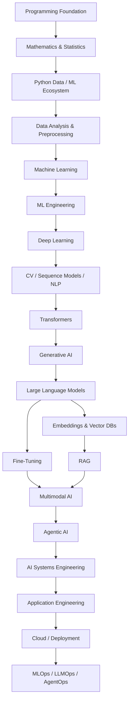
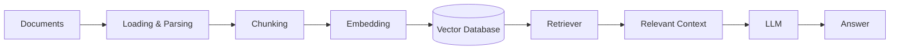
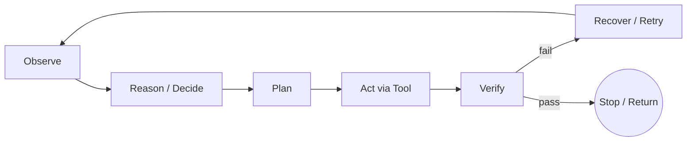

<div align="center">

# 🧠 AI / ML ROADMAP

### From Python → Machine Learning → Deep Learning → Generative AI → LLMs → RAG → Agentic AI → Production Operations

<p><strong>A structured, dependency-first roadmap for learning and building modern AI systems — and choosing a career inside it.</strong></p>


</div>

---

## 📌 About This Roadmap

This repository contains a **complete, structured roadmap for Artificial Intelligence and Machine Learning**, progressing from programming fundamentals to production-grade AI and agentic systems — and closing the loop by mapping every layer to a real career path.

The roadmap is organized by **conceptual dependency**, not by tool popularity.



> **Legend:** 🟢 Foundation · 🔵 Core · 🟣 Advanced · 🟠 Production

---

# PART 1 — AUDIT SUMMARY

The previous version was reviewed against current, primary-source terminology (vendor engineering blogs, the OWASP Agentic Top 10, and recent agent-harness literature). Only substantive issues are listed.

| # | Issue | Category | Correction |
|---|-------|----------|------------|
| 1 | "Ciao Engineering" is not an established AI engineering term | `[OUTDATED TERMINOLOGY]` | No credible source defines this as an AI/agent discipline. It is not used here. The two real, distinct terms are **Harness Engineering** (the runtime/system layer around a model) and **Context Engineering** (deciding what information enters the model's context window) — both added explicitly below. |
| 2 | Harness Engineering was mentioned only as a bullet inside Agentic AI | `[MISSING CONCEPT]` | Promoted to its own subsection with a clear **Model vs Agent vs Agent Runtime vs Harness vs AI System** distinction. |
| 3 | Context Engineering was absent entirely | `[MISSING CONCEPT]` | Added as a first-class concept distinct from Prompt Engineering (single-turn wording) and Harness Engineering (the system that manages context). |
| 4 | MLOps, LLMOps, and AgentOps were implied to be one blended discipline | `[OVERLAPPING CONCEPT]` | Split into three explicit sections with a note that AgentOps is the least standardized of the three and builds on the other two rather than replacing them. |
| 5 | "Open-source AI" was never distinguished from "open-weight" or "proprietary" | `[MISPLACED CONCEPT]` | Added a dedicated **Open AI Ecosystem** section that separates open-weight, fully open (weights + data + code), source-available, and proprietary/API-only models. |
| 6 | No mention of tool/context protocols (e.g., MCP) | `[MISSING CONCEPT]` | Added under both Harness Engineering and Agent Frameworks as "Tool & Context Protocols." |
| 7 | Agentic RAG was a single bullet | `[MISSING CONCEPT]` | Expanded into its own hierarchy (query planning, iterative/corrective retrieval, tool-augmented retrieval, verification). |
| 8 | Careers section was a flat list with no skill mapping | `[MISSING CONCEPT]` | Replaced with a full career map, a role-detail matrix, and a roadmap-layer-to-role matrix, with an explicit disclaimer that titles are not standardized across companies. |
| 9 | "AI Systems Engineering" was implied but never named as its own layer between Agentic AI and Application Engineering | `[MISPLACED CONCEPT]` | Added as its own layer: it owns orchestration, guardrails, and reliability of the whole agent/AI system, distinct from building the customer-facing application. |
| 10 | Reinforcement Learning framing | `[UNNECESSARY / LOW PRIORITY]` — already correct | The original note ("RL learns from interaction, not a labeled dataset") is accurate and preserved verbatim; no change needed. |
| 11 | Model Routing / Gateways not covered | `[MISSING CONCEPT]` | Added under both the Open AI Ecosystem and LLMOps sections. |
| 12 | Agent Frameworks (§20) duplicated some Agentic AI (§19) content without a clear boundary | `[OVERLAPPING CONCEPT]` | Section 20 is now scoped strictly to concrete frameworks/tools; conceptual material (memory, planning, multi-agent) stays in §19. |

---

# PART 2 — README.md

> Everything below this line is the final, refined, ready-to-paste roadmap.

<details open>
<summary><h2>🟢 01 — Programming Foundation</h2></summary>

### Python
Syntax · Variables & Data Types · Operators · Conditionals · Loops · Functions · Recursion · Lists · Tuples · Sets · Dictionaries · Strings · Comprehensions · Iterators · Generators · Lambdas · Decorators · OOP (Classes, Inheritance, Polymorphism, Encapsulation, Abstraction) · Modules & Packages · Exception Handling · File Handling · Virtual Environments · `pip` · Type Hints · Testing · Debugging

### Development Tools
Git · GitHub · Branching · Merging · Pull Requests · Version Control · Basic Linux / Terminal

</details>

---

<details>
<summary><h2>🟢 02 — Mathematics & Statistics</h2></summary>

**Linear Algebra:** Scalars, Vectors, Matrices, Matrix Operations, Dot Product, Norms, Linear Transformations, Eigenvalues/Eigenvectors, SVD
**Calculus:** Functions, Limits, Derivatives, Partial Derivatives, Gradients, Chain Rule, Integrals, Optimization
**Probability:** Random Variables, Conditional Probability, Bayes' Theorem, Expectation, Variance, Covariance, Distributions
**Statistics:** Mean/Median/Mode, Variance, Std Dev, Sampling, Confidence Intervals, Hypothesis Testing, Correlation
**Optimization:** Objective Functions, Loss Functions, Gradient Descent, Learning Rate, Convexity Basics
**Information Theory:** Entropy, Cross-Entropy, KL Divergence

</details>

---

<details>
<summary><h2>🔵 03 — Python Data & ML Ecosystem</h2></summary>

| Library | Purpose |
|---|---|
| NumPy | Numerical computing |
| Pandas | Data manipulation |
| Matplotlib / Seaborn | Visualization |
| SciPy | Scientific computing |
| Scikit-learn | Classical machine learning |
| Jupyter | Interactive experimentation |

</details>

---

<details>
<summary><h2>🔵 04 — Data Analysis & Preprocessing</h2></summary>

**Data Preparation:** Collection, Cleaning, EDA, Missing Values, Duplicates, Outlier Detection, Categorical Encoding, Feature Scaling, Normalization, Standardization
**Feature Engineering:** Creation, Transformation, Selection, Dimensionality Reduction
**Dataset Management:** Train/Validation/Test Split, Cross-Validation, Data Leakage, Class Imbalance, Data Augmentation, Reproducibility

</details>

---

<details>
<summary><h2>🔵 05 — Machine Learning</h2></summary>

### Supervised Learning
**Regression:** Linear, Polynomial, Regularization (Ridge/Lasso/ElasticNet)
**Classification:** Logistic Regression, KNN, Naive Bayes, Decision Trees, Random Forest, SVM, Gradient Boosting, XGBoost, LightGBM, CatBoost

### Unsupervised Learning
**Clustering:** K-Means, Hierarchical, DBSCAN, Gaussian Mixture Models
**Dimensionality Reduction:** PCA, t-SNE, UMAP
**Other:** Anomaly Detection

### Reinforcement Learning
Learning through interaction with an environment — **the agent still learns from data**, but that data is *experience* (state, action, reward sequences) collected via interaction, not a static labeled dataset.

```text
Agent --Action--> Environment --State + Reward--> Agent --Repeat-->
```

**Concepts:** Agent, Environment, State, Action, Reward, Policy, Value Function, Q-Function, Markov Decision Process, Exploration vs Exploitation
**Algorithms:** Q-Learning, SARSA, DQN, Policy Gradient, Actor-Critic, PPO

</details>

---

<details>
<summary><h2>🔵 06 — ML Engineering</h2></summary>

**Evaluation (Classification):** Accuracy, Precision, Recall, F1, ROC-AUC, PR-AUC, Confusion Matrix
**Evaluation (Regression):** MAE, MSE, RMSE, R²
**Optimization:** Cross-Validation, Hyperparameter Tuning, Grid/Random Search, Bayesian Optimization
**Engineering:** Scikit-learn Pipelines, Model Serialization, Experiment Tracking, Reproducibility, Model Comparison

</details>

---

<details>
<summary><h2>🔵 07 — Deep Learning</h2></summary>

**Neural Networks:** Artificial Neurons, Perceptron, MLP (a fully connected feed-forward network of stacked perceptron-like layers with nonlinear activations — it has no memory or spatial structure, which is why CNNs and RNNs exist for images and sequences), Layers, Weights, Bias, Parameters
**Training:** Forward Propagation, Backpropagation, Computational Graphs, Loss Functions, Activation Functions (ReLU, Sigmoid, Tanh, Softmax)
**Optimizers:** SGD, Momentum, Adam, AdamW
**Regularization:** Dropout, Batch/Layer Normalization, Weight Initialization, LR Scheduling
**Common Problems:** Overfitting, Underfitting, Vanishing/Exploding Gradients
**Frameworks:** PyTorch, TensorFlow, Keras

</details>

---

<details>
<summary><h2>🔵 08 — Computer Vision</h2></summary>

**Foundations:** Images as Tensors, Preprocessing, Augmentation, OpenCV
**CNN:** Convolution, Kernels, Filters, Feature Maps, Pooling, Stride, Padding
**Tasks:** Image Classification, Transfer Learning, Object Detection, Semantic/Instance Segmentation, OCR
**Modern Vision:** YOLO, Vision Transformers, Image Embeddings, Vision-Language Models

</details>

---

<details>
<summary><h2>🔵 09 — Sequence Modeling</h2></summary>

Sequential Data · RNN · LSTM · GRU · Bidirectional RNN · Seq2Seq · Encoder-Decoder · Attention · Teacher Forcing · Sequence Generation

> RNNs/LSTMs remain important historically and for streaming/low-latency or resource-constrained settings; Transformers dominate most modern NLP and multimodal workloads because attention parallelizes and scales better than recurrence.

</details>

---

<details>
<summary><h2>🔵 10 — Natural Language Processing</h2></summary>

**Text Processing:** Cleaning, Tokenization, Stop Words, Stemming, Lemmatization, N-Grams
**Classical NLP:** Bag of Words, TF-IDF
**Word Representations:** Word2Vec, GloVe, FastText, Word Embeddings
**Tasks:** Text Classification, Sentiment Analysis, NER, POS Tagging, Language Modeling, Text Generation

</details>

---

<details>
<summary><h2>🟣 11 — Transformers</h2></summary>

**Attention:** Query, Key, Value, Scaled Dot-Product Attention, Self-Attention, Multi-Head Attention
**Architecture:** Positional Encoding/Embeddings, Feed-Forward Networks, Residual Connections, Layer Normalization, Encoder, Decoder, Encoder-Decoder Architecture, Masked/Causal Attention
**Landmark Architectures:** BERT (encoder-only), GPT (decoder-only), T5 (encoder-decoder)

</details>

---

<details>
<summary><h2>🟣 12 — Generative AI</h2></summary>

**Generative Models:** Autoencoders, VAEs, GANs, Diffusion Models, Foundation Models
**Modalities:** Text, Image, Audio, Video, Multimodal Generation

</details>

---

<details>
<summary><h2>🟣 13 — Large Language Models</h2></summary>

**Fundamentals:** LLM/Transformer Architecture, Foundation Models, Pretraining, Self-Supervised Learning, Next-Token Prediction
**Data:** Dataset Preparation, Filtering, Quality, Tokenization, Vocabulary, Tokens
**Internals:** Embeddings, Parameters, Weights, Logits, Softmax, Attention, Context Window
**Scaling:** Model Size, Scaling Laws, Compute, Training Data
**Inference:** Prompt → Tokens → Logits → Probabilities → Next Token → Repeated Generation → Output

</details>

---

<details>
<summary><h2>🟣 14 — LLM Inference & Decoding</h2></summary>

**Decoding:** Greedy Decoding, Sampling, Temperature, Top-K, Top-P/Nucleus, Beam Search, Repetition Penalty, Stop Tokens
**Inference Engineering:** Context Management, KV Cache, Batching, Streaming, Quantization, Latency, Throughput

</details>

---

<details>
<summary><h2>🟣 15 — LLM Adaptation & Fine-Tuning</h2></summary>

**Prompt Engineering:** Zero-Shot, Few-Shot, System Prompts, Structured Outputs, Prompt Templates
**Fine-Tuning:** Instruction Tuning, SFT, Preference Optimization, RLHF, DPO
**Parameter-Efficient Fine-Tuning:** PEFT, LoRA, QLoRA
**Model Optimization:** Quantization, Distillation

### RAG vs Fine-Tuning

| Requirement | Better Approach |
|---|---|
| Frequently changing knowledge | RAG |
| Private / proprietary documents | RAG |
| External, queryable knowledge | RAG |
| Consistent output format or style | Fine-Tuning |
| Specific task behavior | Fine-Tuning |
| Need both knowledge + behavior | RAG + Fine-Tuning |

</details>

---

<details>
<summary><h2>🟣 16 — Embeddings & Vector Databases</h2></summary>

**Embeddings:** Text/Image/Multimodal Embeddings, Vector Representations, Semantic Similarity, Cosine Similarity
**Vector Search:** Indexing, Similarity Search, Approximate Nearest Neighbor, Metadata Filtering
**Systems:** FAISS, Chroma, Pinecone, Weaviate, Milvus, pgvector

</details>

---

<details>
<summary><h2>🟣 17 — Retrieval-Augmented Generation (RAG)</h2></summary>



**Core Components:** Document Loading/Parsing, Chunking (size & overlap), Embedding, Indexing, Retrieval, Context Construction, Generation, Reranking
**Advanced Retrieval:** Hybrid Search (keyword + vector), Metadata Filtering, Query Expansion/Rewriting, Multi-Query Retrieval, Parent-Child Retrieval, Corrective RAG, Graph RAG
**Evaluation:** Retrieval & Generation Evaluation, Context Relevance, Answer Relevance, Faithfulness, Hallucination Analysis

### Agentic RAG (expanded)

RAG becomes "agentic" when an LLM-driven agent — not a fixed pipeline — decides *whether*, *what*, and *how many times* to retrieve.

```text
Agentic RAG
├── Query Planning        (decompose the question before retrieving)
├── Tool Selection         (choose search vs. SQL vs. vector store vs. web)
├── Iterative Retrieval     (retrieve → read → retrieve again if insufficient)
├── Corrective / Adaptive Retrieval  (detect weak context, reformulate, retry)
└── Verification           (check retrieved evidence actually supports the answer)
```

> **RAG vs Agents:** RAG is a retrieval *architecture* — it fetches documents and feeds them to an LLM. An agent is a *control loop* that decides actions. Agentic RAG is what you get when an agent uses RAG as one of several tools rather than a fixed pipeline stage.

</details>

---

<details>
<summary><h2>🟣 18 — Multimodal AI</h2></summary>

**Modalities:** Text, Images, Audio, Video
**Technologies:** Vision-Language Models, Image Understanding, Speech-to-Text, Text-to-Speech, Audio Understanding, Multimodal Embeddings, Multimodal LLMs

</details>

---

<details>
<summary><h2>🟣 19 — Agentic AI</h2></summary>

An AI agent combines a model with reasoning, tools, state, memory, and the ability to take actions toward a goal, inside a control loop.

### Model vs Agent vs Agent Runtime vs Harness vs AI System

| Term | What it actually is |
|---|---|
| **Model** | The foundation model itself (e.g., an LLM) — reasons over context, produces tokens. Has no memory, tools, or persistence on its own. |
| **Agent** | Model + goal + the ability to choose actions/tools in a loop. "Agent = Model + Harness." |
| **Agent Runtime** | The execution substrate that actually runs the loop: calls the model, invokes tools, tracks state between steps. |
| **Harness** | The full engineering layer *around* the model that turns it into a working agent: context management, tool registry, memory, permissions, verification, retries, observability. The harness is external to the model and is independently testable. |
| **AI System** | The complete production system: one or more agents, the harness, data stores, APIs, UI, monitoring, and the human processes around all of it. |

### Agent Fundamentals
Goal · State · Context · Reasoning · Planning · Action · Observation

### Agent Loop



### Tool Use
Function Calling · APIs · Databases · Search · Code Execution · External Services · **Tool & Context Protocols** (e.g., the Model Context Protocol standardizes how models discover and call tools/context sources across vendors, replacing bespoke per-app integrations)

### Memory & State
Working Memory · Session / Short-Term Memory · Long-Term Memory · Retrieval Memory (vector-backed) · Persistent State (files, databases)

### Context Engineering
The discipline of deciding **what information enters the model's context window, and when** — distinct from Prompt Engineering (wording a single turn) and from Harness Engineering (the system that mechanically manages that context). Poorly engineered context ("context rot") degrades agent performance even with a capable model; the fix is progressive disclosure — a short map up front, with deeper sources pulled in only when needed.

### Planning & Reasoning Patterns
ReAct (reasoning + tool-action chains) · Plan-and-Execute · Reflection · Replanning · Chain-of-Thought / Tree-of-Thought · Human-in-the-Loop

### Harness Engineering
The discipline of designing the constraints, feedback loops, and quality gates that make agents reliable — treating unreliability as a *systems* problem, not only a model problem. Core components:

```text
Harness / Runtime
├── Context Management        (what the agent sees, and when)
├── Model / Provider Access    (which model, fallback models)
├── Model Routing / Gateway
├── Tool Registry & Execution
├── State & Memory Management
├── Agent Loop Control         (when to continue, retry, or stop)
├── Verification               (evidence-based completion, not self-reported success)
├── Retry / Recovery
├── Guardrails & Permissions
├── Sandbox / Execution Environment
├── Observability & Tracing
└── Human Intervention / Approval
```

> Core principle: whenever an agent makes a mistake, the fix is usually a harness change (a rule, a test, a guardrail) — not a new prompt.

### Multi-Agent Systems
Supervisor · Planner · Worker Agents · Communication · Coordination · Handoffs · Shared State · Conflict / Failure Handling

### Production Agent Systems
Agent Orchestration · Model/Provider Layer · Tool Layer · State Layer · Memory Layer · Context Layer · Execution Layer · Evaluation Layer · Guardrails · Permissions · Sandboxing · Observability · Tracing · Watcher/Observer Agents · Failure Recovery · Human Approval

</details>

---

<details>
<summary><h2>🟣 20 — Agent Frameworks & Tooling</h2></summary>

Concrete, current tools that implement the concepts from §19. Frameworks change faster than concepts — treat this list as examples, not foundations.

- **LangChain / LangGraph** — connecting LLMs to tools and modeling agent control flow as graphs
- **LlamaIndex** — ingestion and querying of custom data with LLMs
- **AutoGen / CrewAI** — multi-agent orchestration and collaboration
- **Tool & context protocols** (e.g., MCP-style standards) — vendor-neutral ways for agents to discover tools and context sources
- **Observability tooling** — agent/session tracing, span-based logging, replay

**Key engineering concerns:** Tool Abstractions · Provider Abstractions · Memory/Indexing · Execution Graphs · Agent Orchestration · Observability

</details>

---

<details>
<summary><h2>🟠 21 — Open AI Ecosystem</h2></summary>

These terms are **not interchangeable** — using them precisely matters for licensing, cost, and deployment decisions.

| Term | Meaning |
|---|---|
| **Proprietary / API-only models** | Weights are never released; access is only via a hosted API (e.g., closed frontier models). |
| **Open-weight models** | Model weights are downloadable and locally runnable, but training data/code may not be fully disclosed, and the license may restrict use. |
| **Fully open models** | Weights **and** training data **and** training/eval code are released, typically under a permissive license. |
| **Source-available** | Code is viewable but licensing restricts commercial use or modification — not the same as open source. |

**Related concepts:** Model Hubs (repositories for discovering/downloading weights) · Local Inference · Self-Hosting · Quantization · GPU/CPU Inference · Fine-Tuning Open Models · Inference Servers · **Model Routing / Gateways** (a layer that picks among multiple models/providers per request for cost, latency, or capability reasons)

</details>

---

<details>
<summary><h2>🟠 22 — AI Systems Engineering</h2></summary>

Distinct from Application Engineering (§23): this layer is about making the **agent/AI system itself** reliable, observable, and safe — independent of any particular customer-facing product built on top of it.

- Reliability & failure-mode design for AI-driven systems
- Guardrail and permission design across tools and data
- Evaluation harnesses for non-deterministic components
- Sandboxing and blast-radius control for autonomous actions
- Cross-cutting observability for models, tools, and agents

</details>

---

<details>
<summary><h2>🟠 23 — AI Application Engineering</h2></summary>

Once models, agents, and the surrounding system are understood, build the application around them.

**Backend:** APIs, REST, HTTP, JSON, FastAPI, Authentication, Authorization
**Databases:** PostgreSQL, Redis, SQL, Caching
**Application Architecture:** Async Programming, WebSockets, Background Jobs, Queues, Frontend Integration, Error Handling, Rate Limiting, Secrets Management

```text
Frontend → API/Backend → { LLM · RAG · Tools · Database · Agent }
```

</details>

---

<details>
<summary><h2>🟠 24 — Deployment & Cloud</h2></summary>

**Linux:** Shell, Processes, Environment Variables, Permissions, Networking Basics
**Docker:** Containers, Dockerfiles, Images, Volumes, Networks, Compose, Registries
**Kubernetes:** Pods, Deployments, Services, ConfigMaps, Secrets, Scaling
**Cloud (pick one deeply):** AWS · Azure · Google Cloud — Compute, Storage, Networking, IAM, Load Balancing, Autoscaling, Monitoring
**AI Deployment:** GPU Deployment, Model Serving, Inference Servers, Serverless, Batch vs Real-Time Inference

</details>

---

<details>
<summary><h2>🟠 25 — Production AI Operations: MLOps, LLMOps, AgentOps</h2></summary>

These three are **layers that build on each other**, not competing standards. AgentOps is the newest and the least standardized — expect its tooling and vocabulary to keep shifting.

```text
MLOps                          LLMOps                         AgentOps
├─ Data Pipelines              ├─ Prompt Versioning           ├─ Agent / Trajectory Evaluation
├─ Training                    ├─ Model Evaluation (LLM judge)├─ Tool-Call Monitoring
├─ Experiment Tracking         ├─ Token & Cost Monitoring     ├─ State Inspection
├─ Model Registry              ├─ RAG Evaluation              ├─ Session-Level Tracing / Replay
├─ Data & Model Versioning     ├─ Tracing                     ├─ Multi-Agent Observability
├─ Model Deployment            ├─ Guardrails                  ├─ Human Approval Workflows
├─ Drift Detection             ├─ Model Routing / Gateway     ├─ Failure Analysis
└─ Retraining                  └─ Fallback Models             └─ Agent Reliability / Governance
```

- **MLOps** manages models that behave as *trained*.
- **LLMOps** manages models that behave as *prompted* (non-deterministic, cost-per-call, hallucination-prone).
- **AgentOps** manages systems that *choose their own actions* — the unit of observation is the whole multi-step session, not a single request.

**Tools referenced across all three:** MLflow, DVC (MLOps) · LLM observability/tracing platforms, evaluation frameworks (LLMOps) · agent tracing/replay tooling (AgentOps).

</details>

---

# 🧩 Complete Dependency Map

```text
PROGRAMMING → MATH & STATS → DATA & PYTHON → PREPROCESSING → MACHINE LEARNING
   → ML ENGINEERING → DEEP LEARNING → { CNN | RNN/LSTM | NLP } → TRANSFORMERS
   → GENERATIVE AI → LLMs → { FINE-TUNING | RAG } → MULTIMODAL AI
   → AGENTIC AI → AI SYSTEMS ENGINEERING → APPLICATION ENGINEERING
   → CLOUD / DEPLOYMENT → MLOps / LLMOps / AgentOps
```

# 🧠 Mental Model

| Layer | Question It Answers |
|---|---|
| Python | How do I program? |
| Mathematics | Why do ML algorithms work? |
| Data | How do I prepare useful data? |
| ML | How can machines learn patterns? |
| Deep Learning | How can neural networks learn representations? |
| Computer Vision | How can machines understand images/video? |
| NLP | How can machines process language? |
| Transformers | How do modern foundation models process sequences? |
| Generative AI | How can models generate new content? |
| LLMs | How do language foundation models work? |
| Fine-Tuning | How can I adapt model behavior? |
| RAG | How can I give models external, current knowledge? |
| Multimodal AI | How can models work across modalities? |
| Agentic AI | How can models reason, use tools, and complete multi-step tasks? |
| AI Systems Engineering | How do I make the agent/system itself reliable and safe? |
| Application Engineering | How do I turn a system into a usable product? |
| Cloud | Where does my application run? |
| MLOps / LLMOps / AgentOps | How do I operate each layer reliably in production? |

---

# ⚖️ Key Conceptual Distinctions

**Machine Learning vs Deep Learning** — ML learns from engineered/structured features (e.g., linear regression, random forests); Deep Learning automatically learns hierarchical representations directly from raw data (CNNs, transformers).

**Supervised vs Unsupervised vs Reinforcement**

| Type | Signal | Example |
|---|---|---|
| Supervised | Labeled examples | Classification |
| Unsupervised | Unlabeled data | Clustering |
| Reinforcement | Experience + rewards from interaction | Game-playing agent |

**RAG vs Fine-Tuning vs Agents** — RAG supplies external knowledge at inference time; Fine-Tuning changes model behavior/parameters; an Agent is a control loop that can *use either* (and other tools) to accomplish a goal.

**Model vs Application** — a model is one component; a real AI application also needs data, RAG, tools, an agent loop, an API layer, auth, a UI, monitoring, and deployment.

---

# 🛠️ Suggested Technology Stack

| Area | Technologies |
|---|---|
| Programming | Python |
| Numerical / Data | NumPy, Pandas |
| Visualization | Matplotlib, Seaborn |
| Classical ML | Scikit-learn |
| Deep Learning | PyTorch |
| Computer Vision | OpenCV, YOLO |
| NLP | Hugging Face Transformers |
| LLMs | Hugging Face Hub, open-weight model families |
| Agent Frameworks | LangChain / LangGraph, LlamaIndex, AutoGen, CrewAI |
| RAG / Vector DB | FAISS, Chroma, Pinecone, Weaviate |
| Backend | FastAPI, Flask |
| Database | PostgreSQL, Redis |
| Containers | Docker, Kubernetes |
| Cloud | AWS / Azure / GCP |
| MLOps | MLflow, DVC |
| LLMOps / AgentOps | tracing & evaluation platforms (fast-moving category — evaluate current options) |
| Version Control | Git + GitHub |

> Learn the concepts first; pick tools as needed. Treat this table as *current tools*, not permanent foundations.

---

# 🧑‍💼 AI / Data / ML Career Map

> **Important:** Job titles in this field are **not standardized**. Different companies use overlapping titles for similar work, and the same title can mean different things at different companies. Use this map to understand *responsibilities*, not to expect an exact title match.

```text
Artificial Intelligence & Data
├── Data & Analytics
│   ├── Data Analyst
│   ├── Analytics Engineer
│   ├── Data Engineer
│   └── Data Architect
├── Data Science
│   └── Data Scientist
├── Machine Learning
│   ├── ML Engineer
│   ├── MLOps Engineer
│   └── ML Platform / Research Engineer
├── AI / Generative AI
│   ├── AI Engineer
│   ├── LLM Engineer
│   ├── RAG Engineer
│   ├── NLP Engineer
│   └── Computer Vision Engineer
├── Agentic Systems
│   ├── Agentic AI Engineer
│   ├── AI Systems Engineer
│   └── Multi-Agent Systems Engineer
├── Research
│   └── Research Scientist
├── Architecture & Product
│   └── AI Solutions Architect
└── Domain-Specific AI
    ├── Financial Data Scientist / Quantitative Analyst
    └── Healthcare AI / other domain specialists
```

## Role Matrix

| Role | What They Actually Do | Core Knowledge | Key Technologies | Portfolio Evidence |
|---|---|---|---|---|
| Data Analyst | Turns raw data into reports/insights | SQL, statistics, visualization | BI tools, SQL, Pandas | Dashboards, analysis writeups |
| Analytics Engineer | Builds clean, modeled datasets for analysts | SQL, data modeling | dbt, warehouse SQL | Modeled data pipelines |
| Data Engineer | Builds/maintains data infrastructure & pipelines | ETL, databases, distributed systems | Airflow, Spark, cloud data services | Production pipelines |
| Data Architect | Designs data systems & standards org-wide | Data modeling, governance | Warehouses, lakehouses | Architecture docs |
| Data Scientist | Extracts patterns, builds predictive models | Statistics, ML, experimentation | Scikit-learn, SQL, notebooks | Modeling case studies |
| ML Engineer | Turns models into scalable production systems | Software engineering + ML | PyTorch, APIs, cloud | Deployed model service |
| MLOps Engineer | Owns ML deployment pipelines & lifecycle | CI/CD, infra, monitoring | MLflow, Docker, Kubernetes | CI/CD pipeline for a model |
| AI Engineer | Builds end-to-end AI products (LLMs, RAG, agents) | APIs, LLM integration, backend | LangChain, FastAPI | A working AI product |
| LLM Engineer | Works on fine-tuning, inference, and evaluation of LLMs | Transformers, PEFT, inference internals | Hugging Face, LoRA/QLoRA | Fine-tuned/evaluated model |
| RAG Engineer | Designs retrieval pipelines that ground LLMs | Embeddings, vector search | FAISS/Pinecone, chunking strategy | RAG pipeline with eval |
| NLP Engineer | Builds text-understanding systems | Classical + modern NLP | spaCy, Transformers | NLP pipeline/service |
| Computer Vision Engineer | Builds vision models/pipelines | CNNs, detection/segmentation | OpenCV, YOLO | Vision demo/service |
| Agentic AI Engineer | Designs autonomous agents & multi-agent systems | Harness engineering, planning, memory | LangGraph, tool APIs | Working agent with eval traces |
| AI Systems Engineer | Ensures agent/AI systems are reliable and safe | Guardrails, observability, sandboxing | Tracing tools, eval harnesses | Reliability/observability writeup |
| Multi-Agent Systems Engineer | Builds coordinated multi-agent workflows | Orchestration, communication protocols | CrewAI/AutoGen | Multi-agent demo |
| Research Scientist | Advances the underlying science | Deep math/ML theory | Research codebases, papers | Publications |
| AI Solutions Architect | Designs AI systems for business needs | Systems design, cross-domain fluency | Cloud, integration patterns | Architecture proposals |
| Financial Data Scientist / Quant | Applies statistical/ML modeling to markets | Statistics, time series, finance | Python, backtesting frameworks | Backtested strategy writeup |

## Roadmap-Layer → Role Relevance

●●● Deep expertise · ●●○ Strong working knowledge · ●○○ Basic understanding · — Usually not required

| Roadmap Layer | Data Analyst | Data Scientist | ML Engineer | AI Engineer | RAG Engineer | Agentic AI Engineer | AI Systems Engineer | MLOps |
|---|---|---|---|---|---|---|---|---|
| Data Analysis | ●●● | ●●● | ●●○ | ●○○ | ●○○ | — | ●○○ | ●●○ |
| Machine Learning | ●○○ | ●●● | ●●● | ●○○ | ●○○ | ●○○ | ●○○ | ●●○ |
| Deep Learning | — | ●●○ | ●●● | ●●○ | ●○○ | ●○○ | ●○○ | ●○○ |
| Transformers / LLMs | — | ●○○ | ●●○ | ●●● | ●●○ | ●●● | ●●○ | ●○○ |
| RAG | — | ●○○ | ●○○ | ●●● | ●●● | ●●○ | ●●○ | ●○○ |
| Agentic AI | — | — | ●○○ | ●●○ | ●●○ | ●●● | ●●● | ●○○ |
| Deployment / Cloud | ●○○ | ●○○ | ●●● | ●●○ | ●●○ | ●●○ | ●●● | ●●● |
| MLOps / LLMOps / AgentOps | ●○○ | ●○○ | ●●● | ●●○ | ●●○ | ●●○ | ●●● | ●●● |

---

# 🌳 Specialization Paths

```text
COMMON FOUNDATION (Python, Math, Data, ML Basics)
├── DATA PATH → SQL, Analytics, Visualization, Data Architecture
├── MACHINE LEARNING PATH → Algorithms, Feature Engineering, Evaluation, MLOps
├── DEEP LEARNING PATH → Neural Networks, CNN, NLP, Transformers
├── GENERATIVE AI PATH → LLMs, Fine-Tuning, RAG, Multimodal AI
├── AGENTIC AI PATH → Agent Design, Harness Engineering, Multi-Agent Systems
└── PLATFORM / OPERATIONS PATH → Backend, Cloud, Docker/K8s, MLOps/LLMOps/AgentOps
```

---

# 🎯 Recommended Learning Strategy

```text
LEARN → UNDERSTAND → IMPLEMENT → BUILD PROJECT → EVALUATE → DEPLOY → IMPROVE
```

**Phase 1:** Python → NumPy/Pandas → Visualization → Math & Statistics
**Phase 2:** Data Preprocessing → Supervised ML → Unsupervised ML → Model Evaluation
**Phase 3:** Neural Networks → Backprop → PyTorch → CNN → RNN/LSTM
**Phase 4:** NLP → Attention → Transformers → BERT/GPT Concepts
**Phase 5:** Generative AI → LLMs → Inference → Prompt Engineering → Fine-Tuning
**Phase 6:** Embeddings → Vector Search → RAG → Advanced RAG → Agentic RAG
**Phase 7:** Tool Calling → Agent Loops → Memory → Harness Engineering → Multi-Agent Systems
**Phase 8:** Application Engineering → Databases → Docker → Cloud → CI/CD → MLOps/LLMOps/AgentOps

---

# 🚀 Project Progression

```text
Python Project → Data Analysis Project → Classical ML Project → Deep Learning Project
   → CV/NLP Project → Transformer Project → LLM Application → RAG Application
   → Agentic AI Application → Production AI System → MLOps/LLMOps/AgentOps
```

---

# 📌 Roadmap Checklist

- [ ] Python · Math & Statistics · NumPy/Pandas
- [ ] Data Analysis & Preprocessing
- [ ] Machine Learning · ML Engineering
- [ ] Deep Learning · Computer Vision · Sequence Models · NLP
- [ ] Transformers · Generative AI
- [ ] LLMs · Inference · Prompt Engineering
- [ ] Fine-Tuning · PEFT/LoRA/QLoRA
- [ ] Embeddings · Vector Databases
- [ ] RAG · Advanced RAG · Agentic RAG
- [ ] Multimodal AI
- [ ] Agentic AI (fundamentals, loop, tools, memory, harness, context engineering)
- [ ] Multi-Agent Systems · Agent Frameworks
- [ ] Open AI Ecosystem (open-weight vs open-source vs proprietary)
- [ ] AI Systems Engineering
- [ ] AI Application Engineering (APIs, databases)
- [ ] Docker · Cloud · CI/CD
- [ ] MLOps · LLMOps · AgentOps
- [ ] Career specialization chosen and mapped to remaining gaps

---

# 📄 License

MIT License — Copyright (c) 2026 Dinesh. Permission is hereby granted, free of charge, to any person obtaining a copy of this software and associated documentation files, to deal in the Software without restriction, subject to the standard MIT terms.

---

<div align="center">

### 🧠 Learn → Build → Deploy → Evaluate → Improve

**AI / ML Roadmap**

</div>
